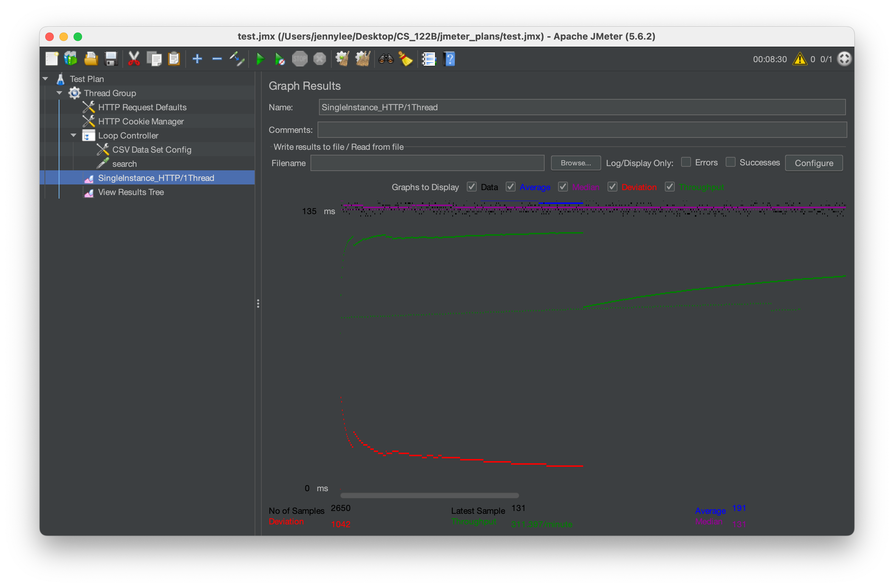
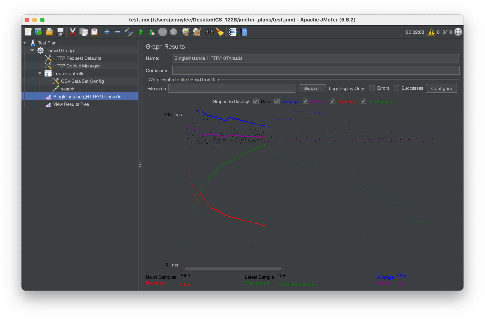
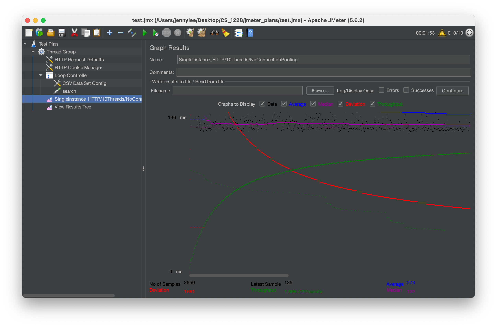
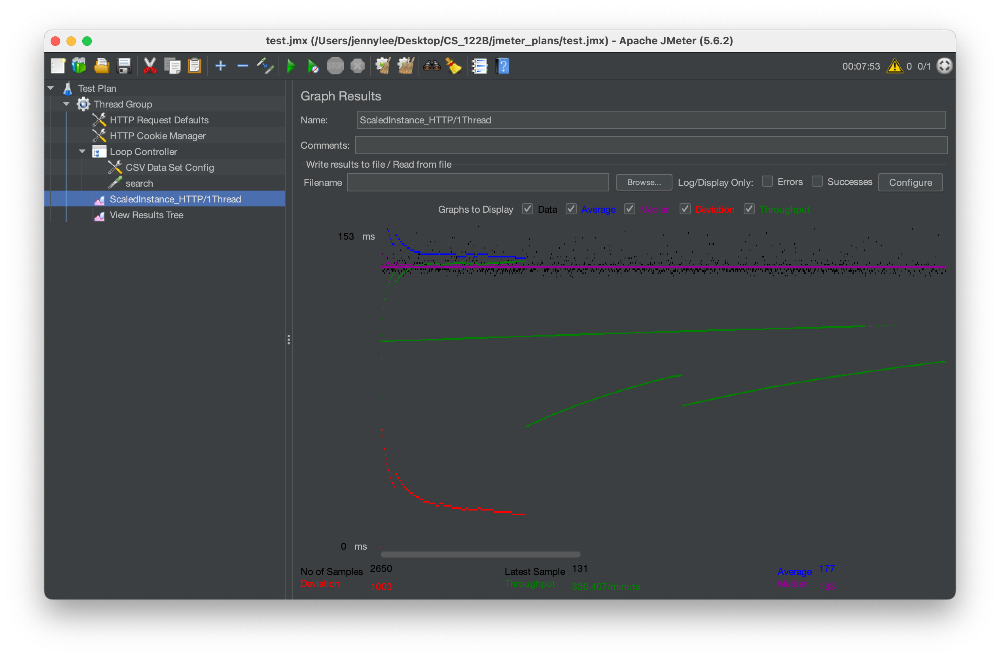
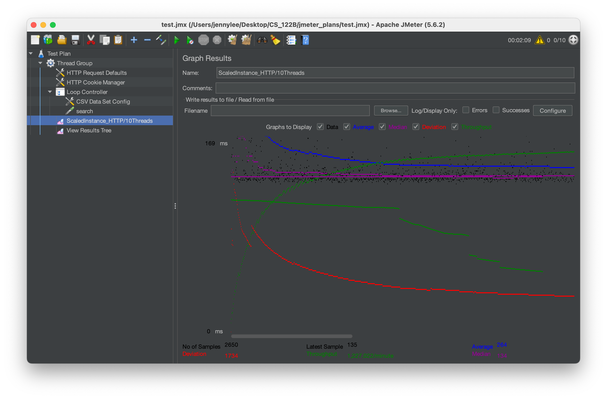
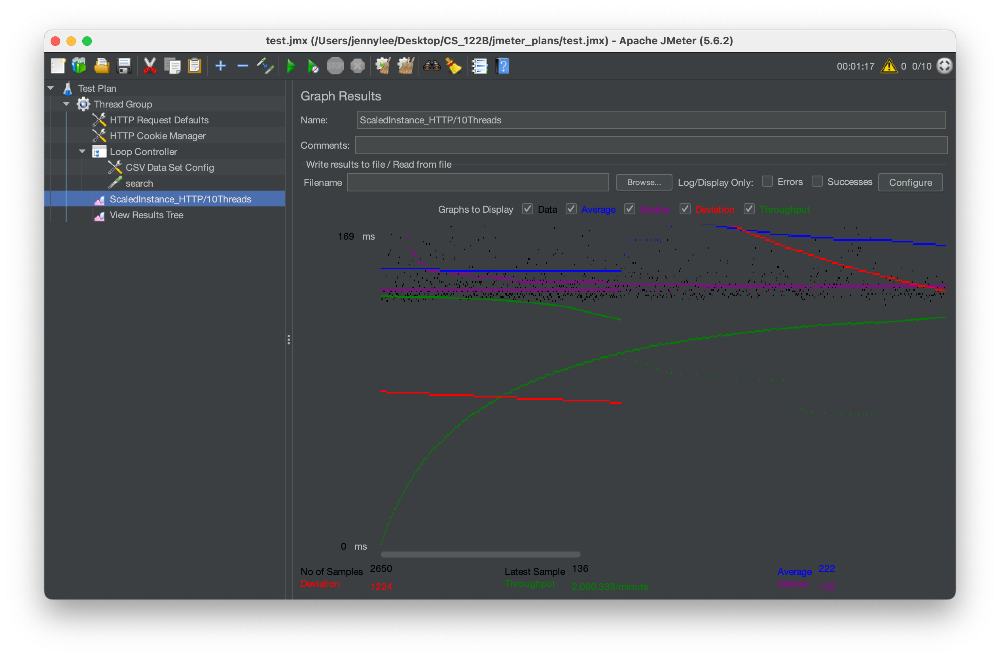

- # General
  - #### Team#: mochi

  - #### Name: Jenny Lee

  - #### Project 5 Video Demo Link: https://youtu.be/ocIsbdcP6lk
  
  - #### Instruction of deployment:
  > 1. Navigate to the project's root directory.
  > 2. Run ```mvn clean package```.
  > 3. Deploy the WAR file generated by Maven by copying it to ```webapps``` directory of Tomcat server.
  > 4. Access the application via ```http://PUBLIC_IP:8080/cs122b-project5/```. (For load balancer, ```http://PUBLIC_IP:80/cs122b-project5```)

     - #### Collaborations and Work Distribution: N/A


- # Connection Pooling
  - #### Include the filename/path of all code/configuration files in GitHub of using JDBC Connection Pooling.
  > - META-INF/context.xml
  > - AddMovieServlet.java
  > - AddStarServlet.java
  > - AutoCompleteServlet.java
  > - BrowseServlet.java
  > - EmployeeLoginServlet.java
  > - IndexServlet.java
  > - LoginServlet.java
  > - PaymentServlet.java
  > - SearchServlet.java
  > - SelectionServlet.java
  > - ShoppingCartServlet.java
  > - SingleMovieServlet.java
  > - SingleStarServlet.java
  > - Top20Servlet.java

  - #### Explain how Connection Pooling is utilized in the Fabflix code.
  > In the Fabflix code, Tomcat10's connection pooling is utilized for efficiency. Two distinct connection pools for 
  > read-write and read-only operations are configured in the ```context.xml``` file, with parameters like ```maxTotal``` 
  > and ```maxIdle``` defining their behavior. 
  > 
  > In Java servlets, rather than creating new database connections, connections are borrowed from the pools using Java 
  > Naming and Directory Interface (JNDI) lookup (```java:comp/env/jdbc/master``` for write, ```java:comp/env/jdbc/slave``` 
  > for read). After completing the database operations, the connections are promptly closed and returned to the pool, 
  > optimizing resource usage and availability for subsequent requests.
  - #### Explain how Connection Pooling works with two backend SQL.
  > Connection pooling with two backend SQL servers in the Fabflix code is adeptly managed through the definition of two
  > distinct connection pools in the ```context.xml``` file—one designated for the master server, responsible for read-write 
  > operations, and another for the slave server, dedicated to read-only tasks. 
  > 
  > When executing a read-write operation, the code retrieves a connection from the master pool. Conversely, for 
  > read-only tasks, the slave connection pool is utilized. This approach ensures an optimized allocation of resources, 
  > enhancing the efficiency of read and write tasks between the master and slave servers. 
  > 
  > The explicit separation of connection pools for different operations contributes to a streamlined and responsive 
  > database access mechanism. By adhering to this strategy, the Fabflix code attains improved performance and resource 
  > utilization, exemplifying a robust implementation of connection pooling for a dual-backend SQL server setup.

- # Master/Slave
  - #### Include the filename/path of all code/configuration files in GitHub of routing queries to Master/Slave SQL.
  > - META-INF/context.xml
  > - AddMovieServlet.java 
  > - AddStarServlet.java 
  > - AutoCompleteServlet.java 
  > - BrowseServlet.java 
  > - EmployeeLoginServlet.java 
  > - IndexServlet.java 
  > - LoginServlet.java 
  > - PaymentServlet.java 
  > - SearchServlet.java 
  > - SelectionServlet.java 
  > - ShoppingCartServlet.java 
  > - SingleMovieServlet.java 
  > - SingleStarServlet.java 
  > - Top20Servlet.java

  - #### How read/write requests were routed to Master/Slave SQL?
  > In the application code, the explicit routing of read and write requests to the master or slave SQL server is 
  > accomplished by selectively choosing the appropriate connection pool based on the nature of the operation. 
  > 
  > For read operations, such as ```SELECT``` statements, the code initiates a JNDI lookup for ```java:comp/env/jdbc/slave``` to 
  > procure a connection from the dedicated slave connection pool. Subsequently, the read request is executed utilizing 
  > this connection, effectively directing the operation to the slave SQL server. 
  > 
  > Conversely, for write operations involving ```INSERT```, ```UPDATE```, or ```DELETE``` statements, the application conducts a JNDI 
  > lookup for ```java:comp/env/jdbc/master``` to acquire a connection from the master connection pool. The ensuing 
  > execution of the write request using this connection ensures that the operation is routed to the master SQL server.

- # JMeter TS/TJ Time Logs
  - #### Instructions of how to use the `log_processing.*` script to process the JMeter logs.
  > 1. Open a terminal or command prompt.
  > 2. Use the following command format: ```python PATH_TO_FILE/log_processing.py file1.txt file2.txt```.
  >   Replace ```file1.txt``` and ```file2.txt``` with the actual names of the files you want to analyze.
  > 3. Execute the command and review the displayed average JDBC and Servlet times.

- # JMeter TS/TJ Time Measurement Report

| **Single-instance Version Test Plan**          | **Graph Results Screenshot**            | **Average Query Time(ms)** | **Average Search Servlet Time(ms)** | **Average JDBC Time(ms)** | **Analysis**                                                                                                                                  |
|------------------------------------------------|-----------------------------------------|----------------------------|-------------------------------|-------------------|-----------------------------------------------------------------------------------------------------------------------------------------------|
| Case 1: HTTP/1 thread                          |               | 191                        | 3.44127                              | 3.02437                  | This demonstrates efficient request handling within its single-threaded configuration, boasting minimal processing times under low-load conditions. |
| Case 2: HTTP/10 threads                        |             | 235                        | 5.28237                              | 4.69535                  | With 10 concurrent threads, there is a noticeable increase in both query time and JDBC time compared to the single-threaded configuration, suggesting a potential performance bottleneck under higher concurrent loads.                                                                                                                                              |
| Case 3: HTTPS/10 threads                       |             | 219                        | 4.72400                              | 4.06265                  | The performance results with 10 concurrent threads for both HTTPS and HTTP are relatively consistent, indicating that the introduction of secure communication (HTTPS) does not significantly impact processing times under this concurrent load.                                                                                                                                              |
| Case 4: HTTP/10 threads/No connection pooling  |  | 273                        | 5.30742                            | 3.71432                  | In the absence of connection pooling, the HTTP with 10 concurrent threads experiences longer query times compared to HTTP with connection pooling, highlighting the efficiency gains provided by connection pooling in optimizing database interactions.                                                                                                                                              |

| **Scaled Version Test Plan**                   | **Graph Results Screenshot**                | **Average Query Time(ms)** | **Average Search Servlet Time(ms)** | **Average JDBC Time(ms)** | **Analysis**                                                                                                                                                                    |
|------------------------------------------------|---------------------------------------------|----------------------------|-------------------------------|---------------------|---------------------------------------------------------------------------------------------------------------------------------------------------------------------------------|
| Case 1: HTTP/1 thread                          |                   | 177                        | 3.59979                              | 3.12802                    | The response times remain nearly identical to the single-instance version, indicating that the application's scalability has minimal impact on performance under low loads.     |
| Case 2: HTTP/10 threads                        |                 | 264                        | 5.94182                              | 5.26093                    | Twhere is a significant increase in the times compared to the single-threaded scaled configuration, suggesting potential performance challenges arising from the concurrent load. |
| Case 3: HTTP/10 threads/No connection pooling  |  | 222                        | 10.84194                              | 6.32775                    | The average search servlet time nearly doubled, highlighting the significant impact of connection pooling on optimizing database interactions.                                                                                                                                                                                |